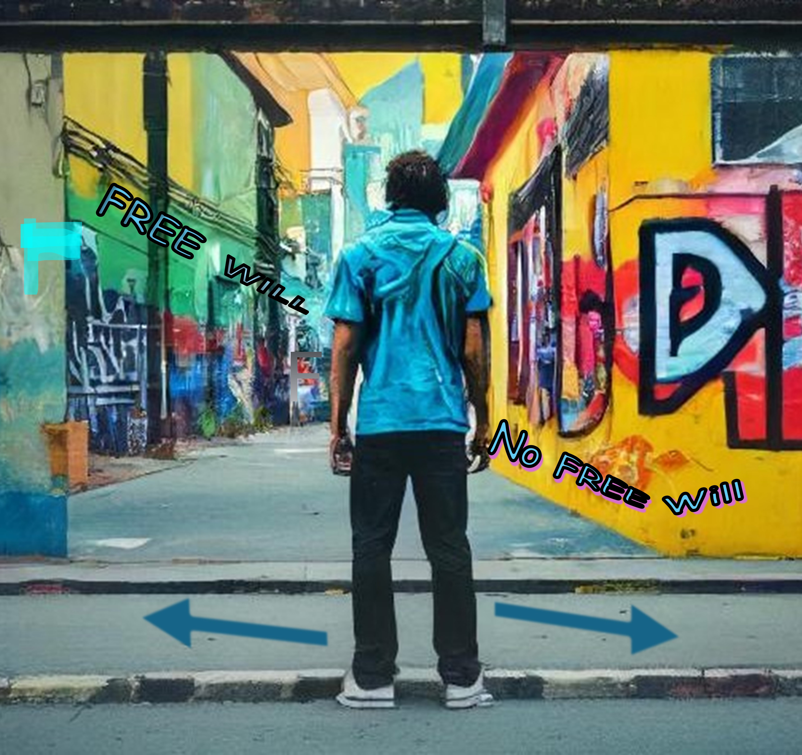

Free will belief (FWB) has long been seen as an essential aspect of human society, both in individual and social behavior. While the answer to the question "Do we have free will?" is best found in philosophical discourse, the belief in free will and its effect on human behavior may be scientifically researched from a cognitive standpoint. However, present approaches for manipulating FWB are mostly focused on abstract arguments against free will and lack the motivating and emotional components required for belief transformation. In the current project we are developing a novel method for manipulating and studying FWBs. The new method is based on cultural practices like storytelling, role-playing, or theater, as well as clinical study procedures (i.e., narrative guided imagery, CBT). These approaches demonstrated that humans can be easily assimilated into imagined possible worlds, and that temporary assimilation in an alternate reality can be used to encourage them to accept an entirely different belief system. As a result, we create emotional narratives that are meaningful to the participants and lengthy enough to allow involvement into the storyline. These narratives serve as the foundation for the interactive guided narrative imagery (GNI) task, which is developing in both PC and virtual reality versions.  

